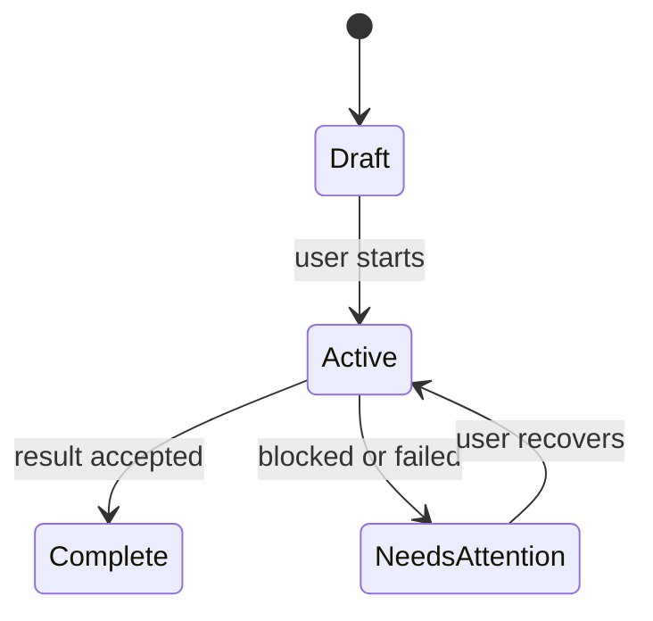

# Product model

<!-- Explain how users understand the product: who participates, which objects
     they handle, how those objects change, and which visible truth they trust.
     Use product language here; implementation structure belongs in architecture. -->

## People and their working context

<!-- Describe a typical day or decision pressure for primary users and
     secondary operators. Explain goals, constraints, skill assumptions, and
     collaboration needs in prose before summarising them. -->

| Person or role | Situation and goal | Friction or risk today | Product responsibility |
|---|---|---|---|
| | | | |

## The objects people work with

<!-- Introduce each core product object positively. Tell how a person creates or
     encounters it, which visible state they rely on, and how it relates to the
     other objects. Do not substitute database entities for the product model. -->

| Product object | Meaning to a user | Created or entered through | Source of visible truth | Related objects |
|---|---|---|---|---|
| | | | | |

## A lifecycle in user language

<!-- Walk the most important object from entry through progress, completion,
     cancellation, failure, recovery, and retention where applicable. Explain
     who can act at each meaningful transition. -->

## Identity, access, and shared use

<!-- Explain sign-in assumptions, workspace or tenant boundaries, permissions,
     multi-user expectations, and what an unauthorised person experiences.
     Write not_applicable with a reason when the product is intentionally
     single-user and has no identity surface. -->

## Data, privacy, retention, and audit expectations

<!-- Describe what users expect to persist, what may be ephemeral, what can be
     exported or deleted, what sensitive content exists, and which actions need
     an audit trail. Link technical enforcement instead of redefining it. -->

| Expectation | User-visible meaning | Product maturity | Architecture or policy owner |
|---|---|---|---|
| | | current / limited / target / out | |

## Product language

<!-- Define repository-specific terms in one positive sentence, then name the
     nearest term a newcomer might confuse with it. -->

| Term | Product meaning | Easily confused with | Distinction |
|---|---|---|---|
| | | | |

## Durable product trade-offs

<!-- Explain the pressure on both sides before recording the chosen posture.
     A trade-off is useful only when it guides future product decisions. -->

| Tension | Chosen posture | User benefit | Cost or limitation | Revisit signal |
|---|---|---|---|---|
| | | | | |

## Product-to-architecture handoff

| Product constraint | Why users care | Architecture owner | Open implementation gap |
|---|---|---|---|
| | | [Architecture](../02-architecture/README.md) | |
