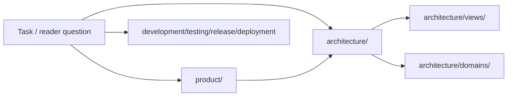

# SSOT

> Writing style: any cold reader. See `ssot-bootstrap` §3.7.

> Single source of truth for repository facts. Agents read this file before starting tasks.

## What this repo is

<!-- Required one-sentence positioning: what this repo is, who it serves, what it does. Tech stack, runtime form, and repository type belong to architecture/README.md; primary capabilities belong to product/prd.md. Do not redefine those here. -->

<one-sentence-positioning>

Tech stack, runtime form, and repository type live in [architecture/README.md](./architecture/README.md). Primary capabilities live in [product/prd.md](./product/prd.md).

## At-a-Glance Map / Reader Map

> Entry-level map to help readers quickly locate authoritative locations. Each row must point to an SSOT authoritative area; do not maintain independent long-lived facts here. Only write entry questions, preferred read location, key evidence direction, and risk hints.

| Reader question | First stop | Authoritative owner | Evidence direction | Stop condition / risk |
|---|---|---|---|---|
| Why does the product exist, what does it promise, what does it not do, and how is it accepted? | [product/](./product/README.md) | product trunk README | PRD / product docs / user-provided source material / acceptance evidence | Core read; product facts must not be duplicated in architecture or README |
| How does the system run, where are the boundaries, which constraints cannot be broken? | [architecture/](./architecture/README.md) | architecture trunk README | code / config / schema / tests / source material | Core read |
| How do I run locally, build, generate, and modify code? | [development/](./development/README.md) | development area README | package scripts / Makefile / Dockerfile / tool scripts | Reference read |
| How do I verify changes, and which tests protect historical issues? | [testing/](./testing/README.md) | testing area README | test configs / CI / fixtures / bug regression links | Reference read |
| How are versioning, release, and delivery consistency maintained? | [release/](./release/README.md) / [deployment/](./deployment/README.md) | release / deployment area READMEs | release scripts / CI / version files | Reference read |

### Global Reading Path Diagram

> Optional. Complex repositories may use Mermaid to express the first layer of reading paths; small repositories write `not_applicable` and the reason. The diagram only does entry routing and does not carry independent facts.

## First-day reading order

> Required by doctor `[FIRST-DAY]` (14X). A cold coding agent landing in this repo for the first time follows these 5 steps in order. Each step is a thin link plus one-line reason; do not duplicate body content from area READMEs.

1. **Positioning** — read the one-sentence repo positioning above and the [STATUS.md](./STATUS.md) gate header so you know what waterline you're on.
2. **Architecture root** — read [architecture/README.md](./architecture/README.md) to load the Runtime Owner Map, core invariants, and view/domain index.
3. **Domain map** — pick the runtime owner that matches your task and read its `architecture/<domain>/README.md`; if it carries an operational task branch, also read its sibling `playbook.md`.
4. **Product spine** — when the task touches user-observable behavior, read [product/README.md](./product/README.md) and the relevant `product/capabilities/<name>.md`; the capability's `Capability → Surface registry` is your first-line route + component + test anchor.
5. **STATUS gates** — re-read [STATUS.md](./STATUS.md) for open adjudications, open gaps, and the source-material absorption matrix before you act.

## Area Index

| Area | Path | Read tier | Status |
|---|---|---|---|
| Product spine | [product/](./product/README.md) | Core | |
| System architecture backbone | [architecture/](./architecture/README.md) | Core | |
| Glossary | [glossary/](./glossary/README.md) | Reference | |
| Development workflow | [development/](./development/README.md) | Reference | |
| Testing strategy | [testing/](./testing/README.md) | Reference | |
| Deployment and distribution | [deployment/](./deployment/README.md) | Reference | |
| Release process | [release/](./release/README.md) | Reference | |
| Major decisions | [decisions/](./decisions/README.md) | Reference | |
| Known gotchas | [gotchas/](./gotchas/README.md) | Reference | |
| Bug fix records | [bugs/](./bugs/README.md) | Reference | |
| Tech debt | [tech-debt/](./tech-debt/README.md) | Reference | |

## Task Entry Mapping

> Conditional thin index. Only maintain when git history, commit review, or long-running sessions show clusters of high-frequency/high-risk engineering tasks; otherwise write `not_applicable`. This table only links to authoritative locations and does not maintain independent facts or playbook bodies.

| Task cluster | Trigger signals | Read first | Authoritative location | Final check |
|---|---|---|---|---|
| | | | | |

See [STATUS.md](./STATUS.md) for maintenance status.
