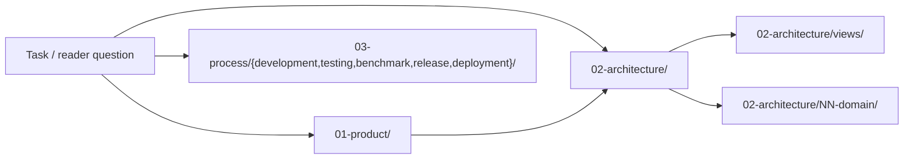

# SSOT

> Writing style: any cold reader. Every section opens with prose before tables;
> tables are indexes, not paragraphs. Walkthrough / Easily confused with / Out
> of scope / See also are reader-facing structural slots — fill them or write
> explicit `not_applicable: <reason>`. See `ssot-bootstrap` §3.7 and
> `SKILL_STYLE.md` reader-scaffolds section.

> Single source of truth for repository facts. Agents read this file before starting tasks.

## What this repo is

<!-- Required one-sentence positioning: what this repo is, who it serves, what it does. Tech stack, runtime form, and repository type belong to 02-architecture/README.md; primary capabilities belong to 01-product/prd.md. Do not redefine those here. -->

<one-sentence-positioning>

Tech stack, runtime form, and repository type live in [02-architecture/README.md](./02-architecture/README.md). Primary capabilities live in [01-product/prd.md](./01-product/prd.md).

## At-a-Glance Map / Reader Map

> Entry-level map to help readers quickly locate authoritative locations. Each row must point to an SSOT authoritative area; do not maintain independent long-lived facts here. Only write entry questions, preferred read location, key evidence direction, and risk hints.

| Reader question | First stop | Authoritative owner | Evidence direction | Stop condition / risk |
|---|---|---|---|---|
| Why does the product exist, what does it promise, what does it not do, and how is it accepted? | [01-product/](./01-product/README.md) | product trunk README | PRD / product docs / user-provided source material / acceptance evidence | Core read; product facts must not be duplicated in architecture or README |
| How does the system run, where are the boundaries, which constraints cannot be broken? | [02-architecture/](./02-architecture/README.md) | architecture trunk README | code / config / schema / tests / source material | Core read |
| How do I run locally, build, generate, and modify code? | [03-process/development/](./03-process/development/README.md) | development area README | package scripts / Makefile / Dockerfile / tool scripts | Reference read |
| How do I verify changes, and which tests protect historical issues? | [03-process/testing/](./03-process/testing/README.md) | testing area README | test configs / CI / fixtures / bug regression links | Reference read |
| Which benchmark suite, workload, metric, and floor guide performance, cost, or capacity decisions? | [03-process/benchmark/](./03-process/benchmark/README.md) | benchmark area README | benchmark scripts / CI performance jobs / profiling config / research packets | Reference read |
| How are versioning, release, and delivery consistency maintained? | [03-process/release/](./03-process/release/README.md) / [03-process/deployment/](./03-process/deployment/README.md) | release / deployment area READMEs | release scripts / CI / version files | Reference read |

### Global Reading Path Diagram

> Optional. Complex repositories may use Mermaid to express the first layer of reading paths; small repositories write `not_applicable` and the reason. The diagram only does entry routing and does not carry independent facts.

```mermaid
flowchart LR
  start["Task / reader question"] --> arch["02-architecture/"]
  start --> product["01-product/"]
  start --> ops["03-process/{development,testing,benchmark,release,deployment}/"]
  product --> arch
  arch --> views["02-architecture/views/"]
  arch --> domains["02-architecture/NN-domain/"]
```

## First-day reading order

> Required by doctor `[FIRST-DAY]` (14X). A cold coding agent landing in this repo for the first time follows these 5 steps in order. Each step is a thin link plus one-line reason; do not duplicate body content from area READMEs.

1. **Positioning** — read the one-sentence repo positioning above and the [STATUS.md](./STATUS.md) gate header so you know what waterline you're on.
2. **Architecture root** — read [02-architecture/README.md](./02-architecture/README.md) to load the Runtime Owner Map, core invariants, and view/domain index.
3. **Domain map** — pick the runtime owner that matches your task and read its `02-architecture/NN-<domain>/README.md`; if it carries an operational task branch, also read its sibling `playbook.md`.
4. **Product spine** — when the task touches user-observable behavior, read [01-product/README.md](./01-product/README.md) and the relevant `01-product/capabilities/NN-<name>.md`; the capability's `Capability → Surface registry` is your first-line route + component + test anchor.
5. **STATUS gates** — re-read [STATUS.md](./STATUS.md) for open adjudications, open gaps, and the source-material absorption matrix before you act.

## Area Index

| Area | Path | Read tier | Status |
|---|---|---|---|
| Product spine | [01-product/](./01-product/README.md) | Core | |
| System architecture backbone | [02-architecture/](./02-architecture/README.md) | Core | |
| Glossary | [glossary/](./glossary/README.md) | Reference | |
| Development workflow | [03-process/development/](./03-process/development/README.md) | Reference | |
| Testing strategy | [03-process/testing/](./03-process/testing/README.md) | Reference | |
| Benchmark strategy | [03-process/benchmark/](./03-process/benchmark/README.md) | Reference | |
| Deployment and distribution | [03-process/deployment/](./03-process/deployment/README.md) | Reference | |
| Release process | [03-process/release/](./03-process/release/README.md) | Reference | |
| Major decisions | [04-records/decisions/](./04-records/decisions/README.md) | Reference | |
| Research and POC records | [04-records/research/](./04-records/research/README.md) | Reference | |
| Known gotchas | [04-records/gotchas/](./04-records/gotchas/README.md) | Reference | |
| Bug fix records | [04-records/bugs/](./04-records/bugs/README.md) | Reference | |
| Tech debt | [04-records/tech-debt/](./04-records/tech-debt/README.md) | Reference | |

## Walkthrough
<!-- One end-to-end concrete prose walk of THIS owner doing its job. Not a table.
     Skip with explicit `not_applicable: <reason>` when the owner is purely
     indexical (e.g., SSOT/README.md is an index, not a system). -->

## Easily confused with
<!-- 1-3 sibling owners that get confused with this one; one bullet each:
     `**[Sibling]** — [one-line boundary that disambiguates]`. -->

## Out of scope
<!-- 1-line statement of what this owner does NOT answer + pointer to the
     owner that does. Required even when "none" (write `none — covers complete intent`). -->

## See also
<!-- Forward-link bouquet (3-7 outbound links). Inline body MUST avoid
     navigation-only links once this section exists. Each link: one-line
     hook explaining why a reader might go there. -->

## Task Entry Mapping

> Conditional thin index. Only maintain when git history, commit review, or long-running sessions show clusters of high-frequency/high-risk engineering tasks; otherwise write `not_applicable`. This table only links to authoritative locations and does not maintain independent facts or playbook bodies.

| Task cluster | Trigger signals | Read first | Authoritative location | Final check |
|---|---|---|---|---|
| | | | | |

See [STATUS.md](./STATUS.md) for maintenance status.
