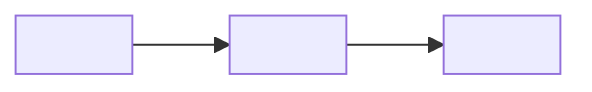

# <runtime owner>

> 行文风格：写给任何冷读者。详见 `ssot-bootstrap` §3.7。

> Architecture domain README。用于一个 runtime owner：拥有独立状态/资源、契约、生命周期、失败/恢复、验证或实现 gap 的边界。不要把本文件当通用 checklist。不适用的可选章节直接删除。

## 为什么这个 Owner 独立

用 1-3 段说明边界、拥有的 runtime responsibility，以及如果并入其他 owner 会导致什么变得不安全或不清楚。

- **包含**：
- **不包含**：
- **主要证据**：

## 拥有的状态与资源

说明这个 owner 写入、持久化、派生或保护的 state/resource。若没有状态/资源职责，用散文说明原因，不要留下空表。

| State / resource | Write owner | Readers / derived users | Lifecycle / persistence | Evidence |
|---|---|---|---|---|
| | this owner | | | |

## 契约面

只列这个 owner 维护兼容语义的 contract：API、SDK、protocol、event、schema、file format、CLI 或 external integration。每行内联携带 `state: contract | design | poc | debt`（`ssot-bootstrap` §3.7）与 surface anchor（`ssot-preflight/references/architecture.md` §16）。doctor `[SURFACE-PIN]` (14T) 与 `[STATE-TAG]` (14V) 校验本表。

| Contract | Compatibility promise | Callers / consumers | Surface anchor | state | Evidence / tests |
|---|---|---|---|---|---|
| | | | GET /api/foo (`src/.../routes.py:42`) / `frontend/.../Component.tsx` / Playwright `frontend/e2e/foo.spec.ts::name` | contract / design / poc / debt | |

## 生命周期与失败边界

仅在这个 owner 具有独立边界时说明 startup/shutdown、concurrency、retry、rollback、demotion 或 recovery。

| Boundary | Normal lifecycle | Failure / recovery | Evidence |
|---|---|---|---|
| | | | |

## Failure trace

doctor `[FAILURE-TRACE]` (14U) 校验已发生失败模式的回归覆盖；每行对应一个咬过本 owner 的失败模式。

| Failure mode | Detection | Recovery | Regression test or bug | state |
|---|---|---|---|---|

## Runtime Flows

只保留承重 flow：跨边界调用、持久写入、资源生命周期、user/ops/API 行为、locks/transactions/retries、trust boundary 或高风险 dense algorithm。

| Flow | Diagram ID | Why included | State / contract touched | Evidence |
|---|---|---|---|---|
| | `<DOMAIN-FLOW-...-CURRENT>` | | | |

## 不变量

列出让这个 owner 可安全修改的不变量。不要复制 product acceptance 或 root-level invariants。

| Invariant | Why it exists | Consequence if violated | Evidence |
|---|---|---|---|
| | | | |

## Symbols

每个 invariant / contract 行至少携带一个 `path:src/...:LNN` 或 `tests/...::test_*` anchor，让冷读 Agent 一跳即可定位（doctor `[SYMBOL-PIN]` / 14S）。

| Symbol | Kind | Owner anchor | state | Evidence |
|---|---|---|---|---|
| `<symbol name>` | function / class / route / SQL identifier / DOM selector | `path:src/...:LNN` or `tests/...::test_*` | contract / design / poc / debt | |

## 验证与证据

给出修改这个 owner 时的最小充分检查或 runtime evidence。

| Change family | Minimal sufficient verification | Evidence owner |
|---|---|---|
| | | |

## Capability → Surface registry

镜像 `ssot-preflight/references/architecture.md` §16；产品侧镜像在 `product/capabilities/<name>.md`。

| Capability link | Route or module | Component | Test |
|---|---|---|---|

## Playbook

机械任务分支（≥3 个有序操作）写在 [`./playbook.md`](./playbook.md)，模板见 `ssot-bootstrap/assets/templates/{en,zh}/architecture-domain-playbook.md`。若本 domain 没有这类任务分支，写 `not_applicable` 与原因即可。

## Local Current / Target / Gap

这个 owner 拥有其边界内的详细实现姿态。Global CTG 只索引本行，不复制细节。

| Topic | Current | Target | Gap / next evidence |
|---|---|---|---|
| | | | |

## 图

Mermaid fenced block 是权威图。Current 和 target 图必须分开。只在边界、flow、state/resource lifecycle、lifecycle/concurrency、failure/recovery 或 trust/config 不明显时加图。

### 图索引

| Diagram ID | Status | Coverage | Evidence |
|---|---|---|---|
| `<DOMAIN-CTX-CURRENT>` | current / target / stale | boundary/context | |
| `<DOMAIN-FLOW-...-CURRENT>` | current / target / stale | runtime flow | |

### Current Boundary / Context

- **Diagram ID**: `<DOMAIN-CTX-CURRENT>`
- **Status**: `current`
- **Coverage**: boundary and external dependencies。
- **Evidence**:

## decomposition_basis

- **选择的拆分轴**: `runtime owner` / `single-level`
- **为什么这个 owner 独立**:
- **Independence signals**: state / resource / contract / lifecycle / failure / invariant / verification / current-target-gap
- **Rejected false friends**: source directory / package name / team / external topic tree
- **Owner anchor**: 本文件拥有 `<runtime owner>` 的 runtime facts；非 owner facts 链接出去。
- **覆盖深度**: `deep` / `sampled` / `inferred` / `unknown`
- **覆盖范围**:
- **停止审查**: `<reviewer>` 返回 `no-more-required-changes` / `needs-fix`。

## Source Material Pointers

| Source material | Lifecycle / classification | Absorbed fact | Status / conflict |
|---|---|---|---|
| | working/* / historical/* / external/source-material / public/thin-entry; absorb / link-only / stale/conflict / obsolete | | |
