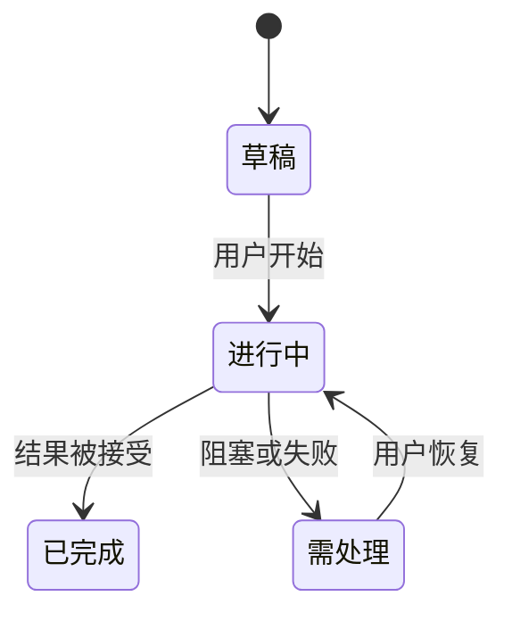

# 产品模型

<!-- 解释用户怎样理解这个产品：谁参与其中、操作哪些产品对象、对象怎样变化，
     以及他们信任哪份可见事实。这里使用产品语言；实现结构属于架构。 -->

## 使用者与工作情境

<!-- 描述主要用户和次要操作者的典型一天或决策压力。先用正文讲清目标、限制、
     技能假设与协作需求，再用表格摘要。 -->

| 人或角色 | 所处情境与目标 | 今天的摩擦或风险 | 产品应承担的责任 |
|---|---|---|---|
| | | | |

## 人们操作的产品对象

<!-- 正面介绍每个核心对象。说明用户怎样创建或遇见它、信任哪一个可见状态，
     以及它与其他对象的关系。不要用数据库实体替代产品模型。 -->

| 产品对象 | 对用户的含义 | 从哪里创建或进入 | 可见事实来源 | 关联对象 |
|---|---|---|---|---|
| | | | | |

## 用用户语言讲生命周期

<!-- 讲述最重要对象从进入、进行、完成、取消、失败、恢复到保留或删除的过程。
     对每个重要转移说明谁能够采取行动。 -->

## 身份、访问与多人使用

<!-- 说明登录假设、工作区或租户边界、权限、多人协作预期，以及无权访问者会
     经历什么。如果产品刻意为单用户且没有身份表面，写出不适用及原因。 -->

## 数据、隐私、保留与审计预期

<!-- 写清用户期待哪些信息持久保存、哪些可以短暂存在、什么能导出或删除、
     哪些内容敏感，以及哪些动作需要审计记录。只链接技术执行，不在此重定义。 -->

| 预期 | 用户可见含义 | 产品成熟度 | 架构或政策所有者 |
|---|---|---|---|
| | | current / limited / target / out | |

## 产品语言

<!-- 用一句正面定义解释仓库特有术语，再写出新读者最容易混淆的相近概念。 -->

| 术语 | 产品含义 | 容易与什么混淆 | 区别 |
|---|---|---|---|
| | | | |

## 持久的产品取舍

<!-- 先解释两侧压力，再记录选择。只有能指导未来产品决策的取舍才留在这里。 -->

| 张力 | 当前选择 | 用户收益 | 代价或限制 | 重新评估信号 |
|---|---|---|---|---|
| | | | | |

## 产品约束怎样交给架构

| 产品约束 | 用户为什么在意 | 架构所有者 | 尚未闭合的实现缺口 |
|---|---|---|---|
| | | [架构](../02-architecture/README.md) | |
