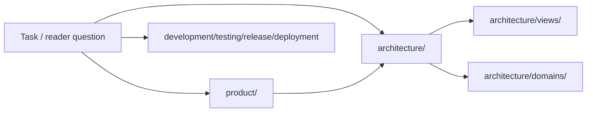

# SSOT

> 行文风格：写给任何冷读者。每节先散文后表格；表格是索引而非段落。
> Walkthrough / Easily confused with / Out of scope / See also 是面向读者的结构槽位 ——
> 要么填写，要么显式 `not_applicable: <原因>`。详见 `ssot-bootstrap` §3.7
> 以及 `SKILL_STYLE.md` reader-scaffolds 章节。

> 仓库事实的单一事实来源。Agent 任务开始前先读此文件。

## 仓库定位

<!-- 必需的一句话定位：这是什么项目、为谁服务、做什么。技术栈、运行时形式和仓库类型属于 architecture/README.md；主要能力属于 product/prd.md。不要在此重定义。 -->

<one-sentence-positioning>

技术栈、运行时形式和仓库类型见 [architecture/README.md](./architecture/README.md)。主要能力见 [product/prd.md](./product/prd.md)。

## 快速理解地图 / Reader Map

> 入口层地图，帮助读者快速定位权威位置。每行必须指向 SSOT 权威区域；不要在这里维护独立长期事实。只写入口问题、优先读取位置、关键证据方向和风险提示。

| 读者问题 | First stop | Authoritative owner | Evidence direction | Stop condition / risk |
|---|---|---|---|---|
| 产品为什么存在、承诺什么、不做什么、如何验收？ | [product/](./product/README.md) | 产品主干 README | PRD / product docs / user-provided source material / acceptance evidence | 核心读取；产品事实不能在 architecture 或 README 中重复维护 |
| 系统如何运行、边界在哪里、哪些约束不能破坏？ | [architecture/](./architecture/README.md) | 架构主干 README | code / config / schema / tests / source material | 核心读取 |
| 如何本地运行、构建、生成和修改代码？ | [development/](./development/README.md) | development 区域 README | package scripts / Makefile / Dockerfile / tool scripts | 参考读取 |
| 改动后如何验证，哪些测试保护历史问题？ | [testing/](./testing/README.md) | testing 区域 README | test configs / CI / fixtures / bug regression links | 参考读取 |
| 版本、发布和交付一致性如何保持？ | [release/](./release/README.md) / [deployment/](./deployment/README.md) | release / deployment 区域 README | release scripts / CI / version files | 参考读取 |

### 全局阅读路径图

> 可选。复杂仓库可用 Mermaid 表达第一层阅读路径；小型仓库写 `not_applicable` 和原因。图只做入口路由，不承载独立事实。

## 第一日阅读顺序

> doctor `[FIRST-DAY]` (14X) 要求。冷启动 coding agent 第一次进入本仓库，按下列 5 步顺序读。每步只写一条链接 + 一句原因，不复制 area README 的正文。

1. **定位** — 读上面的一句话仓库定位与 [STATUS.md](./STATUS.md) 的 gate 标题，先看清当前水位线。
2. **架构 root** — 读 [architecture/README.md](./architecture/README.md)，加载 Runtime Owner Map、核心不变量、views 与 domains 索引。
3. **Domain 地图** — 挑出任务对应的 runtime owner，读其 `architecture/<domain>/README.md`；若该 domain 有 operational task 分支，再读同级 `playbook.md`。
4. **Product spine** — 任务触及用户可观察行为时，读 [product/README.md](./product/README.md) 与对应 `product/capabilities/<name>.md`；capability 的 `Capability → Surface registry` 就是 route + component + test 的第一手 anchor。
5. **STATUS gates** — 动手前再读一次 [STATUS.md](./STATUS.md)，关注 open adjudications、open gaps 与 source-material 吸收矩阵。

## 区域索引

| 区域 | 路径 | 读取层级 | 状态 |
|---|---|---|---|
| 产品主干 | [product/](./product/README.md) | Core | |
| 系统架构主干 | [architecture/](./architecture/README.md) | Core | |
| 专有名词 | [glossary/](./glossary/README.md) | Reference | |
| 开发工作流 | [development/](./development/README.md) | Reference | |
| 测试策略 | [testing/](./testing/README.md) | Reference | |
| 部署与分发 | [deployment/](./deployment/README.md) | Reference | |
| 发布流程 | [release/](./release/README.md) | Reference | |
| 重大决策 | [decisions/](./decisions/README.md) | Reference | |
| 已知陷阱 | [gotchas/](./gotchas/README.md) | Reference | |
| Bug 修复记录 | [bugs/](./bugs/README.md) | Reference | |
| 技术债务 | [tech-debt/](./tech-debt/README.md) | Reference | |

## 走查（Walkthrough）
<!-- 用一段完整的散文描述本 owner 端到端的一次具体工作；不要用表格。
     若 owner 本质是索引（如 SSOT/README.md 不是系统而是索引），显式写
     `not_applicable: <原因>` 跳过。 -->

## 容易混淆（Easily confused with）
<!-- 1-3 个最容易被冷读者混淆的兄弟 owner；每条一行：
     `**[兄弟 owner]** — [区分边界的一句话]`。 -->

## 不回答（Out of scope）
<!-- 一句话说明本 owner 不回答什么，指向回答它的 owner。
     即便没有也必须显式写（如 `none — covers complete intent`）。 -->

## 延伸阅读（See also）
<!-- 3-7 条向外的链接花束；本节存在后，正文中不应再出现纯导航链接。
     每条链接附一句话说明读者为什么要去那里。 -->

## 任务入口映射

> 条件性薄索引。只有 git history、commit 审查或长期会话显示高频/高风险研发任务簇时才维护；否则写 `not_applicable`。本表只链接权威位置，不维护独立事实或 playbook 正文。

| 任务簇 | 触发信号 | 优先读取 | 权威位置 | 最终检查 |
|---|---|---|---|---|
| | | | | |

维护状态见 [STATUS.md](./STATUS.md)。
